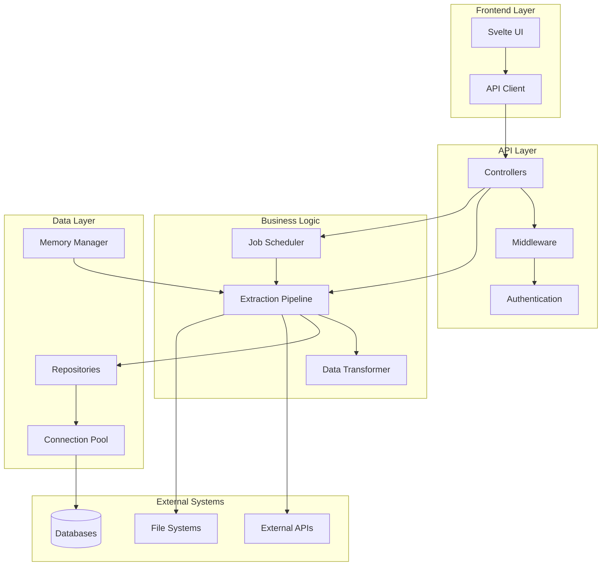

<p align="center">
  <a href="" rel="noopener">
    
  </a>
</p>

<h1 align="center">🎭 Conductor</h1>

<p align="center">
  <strong>High-Performance ETL Platform for Modern Data Engineering</strong>
</p>

<p align="center">
  
  
  
  
  
</p>

<p align="center">
  Conductor is a powerful, enterprise-grade ETL (Extract, Transform, Load) platform designed for seamless data orchestration between databases, APIs, and file systems. Built with modern .NET and featuring a beautiful Svelte frontend, it delivers exceptional performance through advanced parallelization and channel-based processing.
</p>

---

## 📋 Table of Contents

- [✨ Features](#-features)
- [🏗️ Architecture](#️-architecture)
- [🚀 Quick Start](#-quick-start)
- [📖 Installation](#-installation)
- [⚙️ Configuration](#️-configuration)
- [🎯 Usage](#-usage)
- [🔌 API Reference](#-api-reference)
- [🌊 Data Flow](#-data-flow)
- [🔧 Advanced Configuration](#-advanced-configuration)
- [📊 Monitoring & Observability](#-monitoring--observability)
- [🔐 Security](#-security)
- [🐳 Docker Deployment](#-docker-deployment)
- [🧪 Development](#-development)
- [🤝 Contributing](#-contributing)
- [📝 License](#-license)

---

## ✨ Features

### 🚀 **Core Capabilities**
- **High-Performance ETL**: Channel-based producer-consumer pattern for maximum throughput
- **Multi-Database Support**: PostgreSQL, MySQL, SQLite, SQL Server with connection pooling
- **RESTful API Integration**: Native support for HTTP/HTTPS endpoints with pagination
- **Parallel Processing**: Configurable parallel execution with intelligent resource management
- **Real-time Monitoring**: Built-in job tracking, health checks, and performance metrics

### 🎨 **Modern Interface**
- **Intuitive Dashboard**: Clean, responsive Svelte-based UI with Tailwind CSS
- **Job Management**: Visual job scheduling, monitoring, and execution control
- **Data Preview**: Interactive data exploration and validation tools
- **Real-time Updates**: Live status updates and progress tracking

### 🔒 **Enterprise Security**
- **LDAP Authentication**: Enterprise directory integration
- **Data Encryption**: AES-256 encryption for sensitive connection strings
- **Network Security**: IP filtering, CORS configuration, and HTTPS support
- **Role-based Access**: Fine-grained permission system

### 📊 **Observability**
- **OpenTelemetry**: Comprehensive distributed tracing
- **Structured Logging**: Serilog with configurable log levels
- **Health Monitoring**: Docker-ready health checks
- **Error Notifications**: Webhook-based error alerting

### 🔧 **Deployment Ready**
- **Docker Support**: Complete containerization with Docker Compose
- **Environment Configuration**: Flexible configuration management
- **Scalability**: Horizontal scaling capabilities
- **Cloud Ready**: Kubernetes and cloud platform compatible

---

## 🏗️ Architecture



### Key Components

- **🎭 Extraction Pipeline**: Core processing engine with parallel execution
- **🗄️ Connection Pool Manager**: Efficient database connection management
- **🧠 Memory Manager**: Intelligent DataTable lifecycle management
- **📋 Job Tracker**: Comprehensive job scheduling and monitoring
- **🔄 Data Transformers**: Flexible data transformation capabilities
- **🌐 HTTP Exchange**: RESTful API integration layer

---

## 🚀 Quick Start

Get Conductor running in under 5 minutes:

```bash
# Clone the repository
git clone https://github.com/leonardomb1/Conductor.git
cd Conductor

# Start with Docker Compose
docker compose up -d

# Access the application
open http://localhost:3000  # Frontend
open http://localhost:8080  # API
```

That's it! Conductor is now running with a PostgreSQL database and ready to process your data.

---

## 📖 Installation

### Prerequisites

- **.NET SDK 9.0+** - [Download here](https://dotnet.microsoft.com/download)
- **Node.js 18+** - [Download here](https://nodejs.org/)
- **Docker & Docker Compose** - [Install Docker](https://docs.docker.com/get-docker/)
- **PostgreSQL** (optional - included in Docker setup)

### Option 1: Docker Deployment (Recommended)

```bash
# Clone and configure
git clone https://github.com/leonardomb1/Conductor.git
cd Conductor

# Copy and configure environment
cp .env.example .env
# Edit .env with your settings

# Deploy with Docker Compose
docker compose up -d

# Check health status
docker compose ps
```

### Option 2: Local Development

```bash
# Backend setup
cd src/Backend
dotnet restore
dotnet build

# Frontend setup  
cd ../Frontend
npm install
npm run build

# Configure environment
cp .env.example .env
# Edit .env with your database settings

# Run migrations
dotnet run -- --migrate-init-file

# Start the application
dotnet run -- --file
```

### Option 3: Production Binary

```bash
# Download latest release
wget https://github.com/leonardomb1/Conductor/releases/latest/download/conductor-linux-x64.tar.gz

# Extract and run
tar -xzf conductor-linux-x64.tar.gz
cd conductor

# Configure environment
cp .env.example .env
# Edit .env with your settings

# Run migrations and start
./Conductor --migrate-init-file
```

---

## ⚙️ Configuration

### Environment Variables

Create a `.env` file in the project root:

```bash
# Server Configuration
PORT_NUMBER=8080
API_FORWARDED_PORT_NUMBER=8080
FRONTEND_PORT_NUMBER=3000
FRONTEND_FORWARDED_PORT_NUMBER=3000

# Database Configuration
DB_TYPE="PostgreSQL"
CONNECTION_STRING="Server=localhost;Port=5432;Database=ConductorDb;User Id=conductor;Password=your_password;"
POSTGRES_DB="ConductorDb"
POSTGRES_USER="conductor"
POSTGRES_PASSWORD="your_secure_password"

# Security
ENCRYPT_KEY="your-32-character-encryption-key"
API_KEY="your-api-key-here"
SESSION_TIME_SEC=3600
REQUIRE_AUTHENTICATION=true

# Performance & Scaling
MAX_DEGREE_PARALLEL=10
MAX_CONSUMER_FETCH=100
MAX_PRODUCER_LINECOUNT=50000
QUERY_TIMEOUT_SEC=300
CONNECTION_TIMEOUT_MIN=10
MAX_CONCURRENT_CONNECTIONS=200

# LDAP Configuration (Optional)
LDAP_DOMAIN="your-domain.com"
LDAP_SERVER="ldap.your-domain.com"
LDAP_PORT=636
LDAP_SSL=true
LDAP_VERIFY_CERTIFICATE=false

# Monitoring & Logging
ENABLE_LOG_DUMP=true
LOG_DUMP_TIME_SEC=30
DEVELOPMENT_MODE=false
SEND_WEBHOOK_ON_ERROR=true
WEBHOOK_URI="https://your-webhook-endpoint.com"

# Network Security
USE_HTTPS=false
ALLOWED_IP_ADDRESSES="127.0.0.1/32|10.0.0.0/8"
ALLOWED_CORS="https://your-frontend-domain.com"
VERIFY_TCP=true
VERIFY_HTTP=true
VERIFY_CORS=true

# File Export
CSV_OUTPUT_PATH="/app/exports"
HOST_EXPORT_PATH="./exports"
```

### Database Support

Conductor supports multiple database systems:

| Database | Connection String Example |
|----------|--------------------------|
| **PostgreSQL** | `Server=localhost;Port=5432;Database=mydb;User Id=user;Password=pass;` |
| **MySQL** | `Server=localhost;Port=3306;Database=mydb;Uid=user;Pwd=pass;` |
| **SQLite** | `Data Source=app.db;Mode=ReadWriteCreate;` |
| **SQL Server** | `Server=localhost;Database=mydb;User Id=user;Password=pass;` |

---

## 🎯 Usage

### 1. Creating Data Sources

#### Database Origin
```json
{
  "name": "Production Database",
  "dbType": "PostgreSQL",
  "connectionString": "Server=prod-db;Port=5432;Database=sales;User Id=reader;Password=***;"
}
```

#### API Origin
```json
{
  "name": "Sales API",
  "sourceType": "http",
  "endpoint": "https://api.sales.com/v1/orders",
  "httpMethod": "GET",
  "headers": {
    "Authorization": "Bearer your-token",
    "Content-Type": "application/json"
  }
}
```

### 2. Configuring Extractions

```json
{
  "name": "Daily Sales Extract",
  "originId": 1,
  "destinationId": 2,
  "query": "SELECT * FROM sales WHERE created_date >= @FilterDate",
  "isIncremental": true,
  "filterTime": 24,
  "scheduleId": 1
}
```

### 3. Running Extractions

#### Via API
```bash
# Execute transfer (source to destination)
curl -X POST "http://localhost:8080/api/extractions/transfer?scheduleId=1" \
  -H "Authorization: Key your-api-key"

# Execute pull (source to CSV)
curl -X POST "http://localhost:8080/api/extractions/pull?scheduleId=1" \
  -H "Authorization: Key your-api-key"

# Fetch data preview
curl -X GET "http://localhost:8080/api/extractions/fetch?id=1&page=1" \
  -H "Authorization: Key your-api-key"
```

#### Via Frontend
1. Navigate to **Extractions** in the dashboard
2. Select your extraction configuration
3. Click **Execute Transfer** or **Pull Data**
4. Monitor progress in the **Jobs** section

### 4. Scheduling Jobs

```json
{
  "name": "Hourly Sync",
  "cronExpression": "0 0 * * * *",
  "isActive": true,
  "description": "Sync sales data every hour"
}
```

---

## 🔌 API Reference

### Authentication

All API requests require authentication via API key:

```bash
Authorization: Key your-api-key-here
```

### Core Endpoints

#### Extractions
- `GET /api/extractions` - List all extractions
- `POST /api/extractions` - Create new extraction
- `GET /api/extractions/{id}` - Get extraction details
- `PUT /api/extractions/{id}` - Update extraction
- `DELETE /api/extractions/{id}` - Delete extraction
- `POST /api/extractions/transfer` - Execute transfer job
- `POST /api/extractions/pull` - Execute pull job
- `GET /api/extractions/fetch` - Preview data

#### Jobs
- `GET /api/jobs` - List all jobs
- `GET /api/jobs/{id}` - Get job details
- `DELETE /api/jobs/{id}` - Cancel job

#### Origins & Destinations
- `GET /api/origins` - List data sources
- `POST /api/origins` - Create data source
- `GET /api/destinations` - List destinations
- `POST /api/destinations` - Create destination

#### Schedules
- `GET /api/schedules` - List schedules
- `POST /api/schedules` - Create schedule
- `PUT /api/schedules/{id}` - Update schedule

### Query Parameters

#### Filtering
- `name` - Filter by exact name
- `contains` - Filter by partial name match
- `scheduleId` - Filter by schedule ID
- `originId` - Filter by origin ID
- `take` - Limit results

#### Pagination
- `page` - Page number (1-based)
- `pageSize` - Results per page

### Response Format

```json
{
  "statusCode": 200,
  "message": "Success",
  "data": [...],
  "page": 1,
  "hasError": false
}
```

---

## 🌊 Data Flow

### Transfer Process
1. **Source Query** - Execute query against origin database/API
2. **Data Extraction** - Fetch data using parallel processing
3. **Transformation** - Apply any configured transformations
4. **Destination Load** - Insert/update data in destination
5. **Monitoring** - Track progress and handle errors

### Pull Process
1. **Source Query** - Execute query against origin
2. **Data Extraction** - Fetch data in batches
3. **CSV Generation** - Convert to CSV format
4. **File Export** - Save to configured output directory

### Parallel Processing
- **Producer-Consumer Pattern** - Separate data extraction and loading
- **Channel-based Communication** - High-performance data pipeline
- **Configurable Parallelism** - Optimize for your infrastructure
- **Memory Management** - Automatic cleanup and optimization

---

## 🔧 Advanced Configuration

### Connection Pooling

```bash
# Connection pool settings
CONNECTION_POOL_MAX_SIZE=50
CONNECTION_POOL_MIN_SIZE=5
CONNECTION_IDLE_TIMEOUT_MINUTES=30
```

### Memory Management

```bash
# DataTable memory management
DATATABLE_LIFETIME_MINUTES=30
DATATABLE_CLEANUP_INTERVAL_MINUTES=5
MEMORY_PRESSURE_THRESHOLD_GB=4
GC_CHECK_INTERVAL_MINUTES=1
```

### Performance Tuning

```bash
# Parallel processing
MAX_DEGREE_PARALLEL=20
MAX_CONSUMER_FETCH=200
MAX_PRODUCER_LINECOUNT=100000

# Timeouts
QUERY_TIMEOUT_SEC=1800
CONNECTION_TIMEOUT_MIN=15
```

### Custom Transformations

```csharp
// Example transformation script
public class CustomTransformer : IDataTransformer
{
    public async Task<Result<DataTable>> TransformAsync(DataTable input, string script)
    {
        // Your transformation logic here
        return Result.Ok(transformedData);
    }
}
```

---

## 📊 Monitoring & Observability

### Health Checks

```bash
# Check API health
curl http://localhost:8080/api/health

# Check database connectivity
curl http://localhost:8080/api/health/database

# Check external services
curl http://localhost:8080/api/health/external
```

### Metrics & Tracing

- **OpenTelemetry Integration** - Distributed tracing
- **Prometheus Metrics** - Performance monitoring
- **Structured Logging** - Comprehensive audit trail
- **Custom Dashboards** - Grafana-compatible metrics

### Log Levels

```bash
# Configure logging
LOGGING_LEVEL_DEBUG=false
DEVELOPMENT_MODE=false
SEND_WEBHOOK_ON_ERROR=true
```

### Error Handling

- **Automatic Retries** - Configurable retry policies
- **Dead Letter Queues** - Failed message handling
- **Webhook Notifications** - Real-time error alerts
- **Graceful Degradation** - Partial failure handling

---

## 🔐 Security

### Authentication Methods

1. **API Key Authentication** - Simple key-based access
2. **LDAP Integration** - Enterprise directory services
3. **Role-based Access Control** - Fine-grained permissions

### Data Protection

- **Encryption at Rest** - AES-256 encryption for sensitive data
- **Encryption in Transit** - TLS/SSL for all communications
- **Connection String Encryption** - Automatic credential protection
- **IP Whitelisting** - Network-level access control

### Security Best Practices

```bash
# Generate secure encryption key
openssl rand -base64 32

# Configure secure headers
USE_HTTPS=true
VERIFY_CORS=true
VERIFY_TCP=true

# Set up IP filtering
ALLOWED_IP_ADDRESSES="10.0.0.0/8|192.168.0.0/16"
```

---

## 🐳 Docker Deployment

### Docker Compose (Recommended)

```yaml
# docker-compose.yml
version: '3.8'

services:
  conductor-api:
    image: conductor-api:latest
    environment:
      - CONNECTION_STRING=Server=database;Port=5432;Database=ConductorDb;User Id=conductor;Password=password;
    depends_on:
      - database
    ports:
      - "8080:8080"

  conductor-frontend:
    image: conductor-frontend:latest
    environment:
      - API_HOST=conductor-api:8080
    ports:
      - "3000:3000"

  database:
    image: postgres:15
    environment:
      - POSTGRES_DB=ConductorDb
      - POSTGRES_USER=conductor
      - POSTGRES_PASSWORD=password
    volumes:
      - postgres_data:/var/lib/postgresql/data
    ports:
      - "5432:5432"

volumes:
  postgres_data:
```

### Kubernetes Deployment

```yaml
# kubernetes-deployment.yaml
apiVersion: apps/v1
kind: Deployment
metadata:
  name: conductor-api
spec:
  replicas: 3
  selector:
    matchLabels:
      app: conductor-api
  template:
    metadata:
      labels:
        app: conductor-api
    spec:
      containers:
      - name: conductor-api
        image: conductor-api:latest
        ports:
        - containerPort: 8080
        env:
        - name: CONNECTION_STRING
          valueFrom:
            secretKeyRef:
              name: conductor-secrets
              key: connection-string
```

---

## 🧪 Development

### Prerequisites

- .NET 9.0 SDK
- Node.js 18+
- Docker Desktop
- PostgreSQL (optional)

### Setup Development Environment

```bash
# Clone repository
git clone https://github.com/leonardomb1/Conductor.git
cd Conductor

# Backend setup
cd src/Backend
dotnet restore
dotnet build

# Frontend setup
cd ../Frontend
npm install
npm run dev

# Database setup
docker compose up -d database

# Run migrations
dotnet run -- --migrate-init-file

# Start development server
dotnet run -- --file
```

### Project Structure

```
Conductor/
├── src/
│   ├── Backend/
│   │   ├── Controller/          # API controllers
│   │   ├── Service/             # Business logic
│   │   ├── Repository/          # Data access
│   │   ├── Model/               # Entity models
│   │   ├── Middleware/          # Custom middleware
│   │   └── Shared/              # Shared utilities
│   └── Frontend/
│       ├── src/
│       │   ├── routes/          # Svelte routes
│       │   ├── lib/             # Shared components
│       │   └── app.html         # Main template
│       └── static/              # Static assets
├── docker/                      # Docker configurations
├── .github/                     # GitHub Actions
└── docs/                        # Documentation
```

### Running Tests

```bash
# Backend tests
cd src/Backend
dotnet test

# Frontend tests
cd src/Frontend
npm test

# Integration tests
docker compose -f docker-compose.test.yml up --abort-on-container-exit
```

### Code Quality

```bash
# Format code
dotnet format
npm run format

# Lint code
dotnet tool run dotnet-format --verify-no-changes
npm run lint

# Security scan
dotnet tool run security-scan
```

---

## 🤝 Contributing

We welcome contributions! Please see our [Contributing Guide](CONTRIBUTING.md) for details.

### Development Workflow

1. **Fork** the repository
2. **Create** a feature branch (`git checkout -b feature/amazing-feature`)
3. **Commit** your changes (`git commit -m 'Add amazing feature'`)
4. **Push** to the branch (`git push origin feature/amazing-feature`)
5. **Open** a Pull Request

### Code Standards

- Follow [.NET coding conventions](https://docs.microsoft.com/en-us/dotnet/csharp/fundamentals/coding-style/coding-conventions)
- Use [Conventional Commits](https://www.conventionalcommits.org/) for commit messages
- Maintain test coverage above 80%
- Update documentation for new features

### Reporting Issues

- Use the [issue tracker](https://github.com/leonardomb1/Conductor/issues)
- Include reproduction steps and environment details
- Label issues appropriately (bug, enhancement, question)

---

## 📝 License

This project is licensed under the MIT License - see the [LICENSE](LICENSE) file for details.

---

## 🙏 Acknowledgments

- [Microsoft .NET Team](https://dotnet.microsoft.com/) for the excellent .NET platform
- [Svelte Team](https://svelte.dev/) for the amazing frontend framework
- [PostgreSQL Community](https://www.postgresql.org/) for the robust database
- [Docker Team](https://www.docker.com/) for containerization platform
- All contributors and users of this project

---

## 📞 Support

- **Documentation**: [Wiki](https://github.com/leonardomb1/Conductor/wiki)
- **Issues**: [GitHub Issues](https://github.com/leonardomb1/Conductor/issues)
- **Discussions**: [GitHub Discussions](https://github.com/leonardomb1/Conductor/discussions)
- **Email**: [conductor@example.com](mailto:conductor@example.com)

---

<p align="center">
  <strong>⭐ Star this repository if you find it useful!</strong>
</p>

<p align="center">
  Built with ❤️ by <a href="https://github.com/leonardomb1">Leonardo Machado Baptista</a>
</p>

